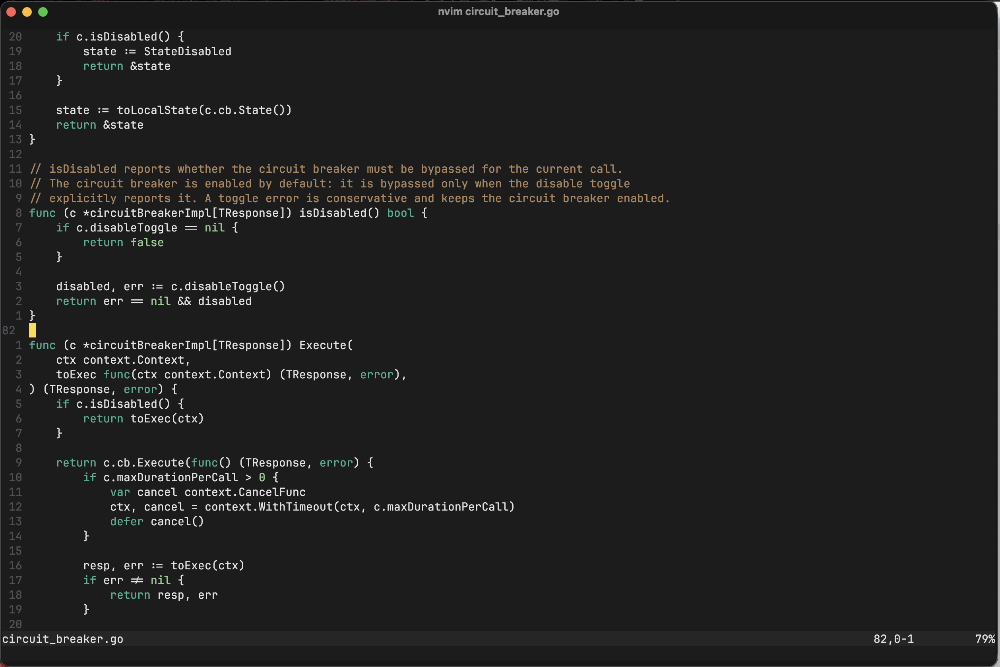

# hm.nvim

A Vim/Neovim colorscheme derived from [gruber.vim](https://github.com/m6vrm/gruber.vim)
by Roman Madyanov, itself ported from John Gruber's BBEdit "Gruber Dark" scheme.



## Install

With [lazy.nvim](https://github.com/folke/lazy.nvim):

```lua
require("lazy").setup({
  'rolton1999/hm.nvim',
})
vim.cmd("colorscheme hm")
```

Or copy `colors/hm.lua` to `~/.config/nvim/colors/`.
